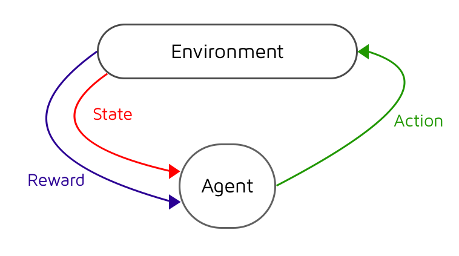

class: center, middle

## Artificial Intelligence

# Neural Networks &

# Deep Learning

<br>

Gerard Escudero, 2019

<br>


.footnote[[Source](http://www.gabormelli.com/RKB/Artificial_Neuron)]

---
class: left, middle, inverse

# Outline

* .cyan[Neural Networks]

* Deep Learning Arquitectures

* Reinforcement Learning

* References

---

# Artificial Neuron Model

.center[]

.center[]

.footnote[Source: [Artificial Neuron](http://www.gabormelli.com/RKB/Artificial_Neuron)]

---

# Perceptron

.cols5050[
.col1[

- Classification and regression

- Linear model

- Classification:

$$h(x)=f(\sum_{i=1}^n w_i x_i + b)$$

- Learning rule:

$$w_i'=w_i+\eta(h(x)-y)$$
]
.col2[


]]

---

# Perceptron in sklearn

```python3
from sklearn.linear_model import Perceptron

clf = Perceptron()
clf.fit(x_train, y_train)
predictions = clf.predict(x_test)
```

**Example:**

- ([view](codes/nn-sklearn.html)) / ([download](codes/nn-sklearn.ipynb))

- [reference](https://scikit-learn.org/stable/modules/generated/sklearn.linear_model.Perceptron.html)

**Main parameters:**

- .blue[max_iter]: default=1000

---

# Multi-layer Perceptron

.col5050[
.col1[- One hidden layer

- Non-linear model

- Classification & regression

- [Backpropagation](https://en.wikipedia.org/wiki/Backpropagation) as training algorithm
]
.col2[

]]

.footnote[Source: [wikipedia](https://en.wikipedia.org/wiki/Artificial_neural_network)]

---

# Multi-Layer Perceptron in sklearn

```python3
from sklearn.neural_network import MLPClassifier

clf = MLPClassifier(hidden_layer_sizes=(25,))
clf.fit(x_train, y_train)
predictions = clf.predict(x_test)
```

**Example:**

- ([view](codes/nn-sklearn.html)) / ([download](codes/nn-sklearn.ipynb))

- [reference](https://scikit-learn.org/stable/modules/generated/sklearn.neural_network.MLPClassifier.html#sklearn.neural_network.MLPClassifier)

**Main parameters:**

- .blue[hidden_layer_sizes]: default (100,)

- .blue[activation]: {‘identity’, ‘logistic’, ‘tanh’, ‘relu’}, default ‘relu’

- .blue[max_iter]: default=200

---

# Bias & Variance

**Remember:**


Normal use of a validation set to select parameters & avoid overfitting!

.footnote[Source: [left](https://towardsdatascience.com/regularization-the-path-to-bias-variance-trade-off-b7a7088b4577), [right](https://elitedatascience.com/overfitting-in-machine-learning)]

---

# Deep Learning

- Neural network with 2 or more hidden layers


.footnote[Source: [The Neural Network Zoo](https://www.asimovinstitute.org/neural-network-zoo/)]

---

# Deep Learning

**Example:**

- Sklearn on Iris
  - [view](codes/nn-sklearn.html)
  - [download](codes/nn-sklearn.ipynb)

- Keras on MNIST
  - [view](codes/keras-mlp.html)
  - [download](codes/keras-mlp.ipynb)
  - [Source](https://github.com/keras-team/keras)

---
class: left, middle, inverse

# Outline

* .brown[Neural Networks]

* .cyan[Deep Learning Arquitectures]

* Reinforcement Learning

* References

---

# Convolutional Neural Networks

**from Computer Vision**

to process image & video


.footnote[Source: [A Comprehensive Guide to Convolutional Neural Networks](https://towardsdatascience.com/a-comprehensive-guide-to-convolutional-neural-networks-the-eli5-way-3bd2b1164a53)]

---

# Convolutional Neural Networks II

.cols5050[
.col1[
- Convolution: extract the high-level features such as edges

- Pooling: reduce dimensionality for 
  - computational cost
  - extracting dominant features which are rotational and positional invariant

- Example:
  - Keras on MNIST
  - [view](codes/keras-cnn.html) / [download](codes/keras-cnn.ipynb)
  - [Source](https://github.com/keras-team/keras)
]
.col2[


]]

.footnote[Source: [A Comprehensive Guide to Convolutional Neural Networks](https://towardsdatascience.com/a-comprehensive-guide-to-convolutional-neural-networks-the-eli5-way-3bd2b1164a53)]

---

# The Neural Network Zoo


.footnote[Source: [The Neural Network Zoo](https://www.asimovinstitute.org/neural-network-zoo/)]

---

# The Neural Network Zoo II


.footnote[Source: [The Neural Network Zoo](https://www.asimovinstitute.org/neural-network-zoo/)]

---

# The Neural Network Zoo III


.footnote[Source: [The Neural Network Zoo](https://www.asimovinstitute.org/neural-network-zoo/)]

---
class: left, middle, inverse

# Outline

* .brown[Neural Networks]

* .brown[Deep Learning Arquitectures]

* .cyan[Reinforcement Learning]

* References

---

# Reinforcement Learning



.cols5050[
.col1[
- an _agent_
- a set of states $S$
- a set of actions $A$

]
.col2[
Learning a reward function $Q: S \times A \to \mathbb{R}$ for maximizing the total future reward.

]]

- _Q-Learning_: method for learning an aproximation of $Q$.

.footnote[Source: [My Journey Into Deep Q-Learning with Keras and Gym](https://medium.com/@gtnjuvin/my-journey-into-deep-q-learning-with-keras-and-gym-3e779cc12762)]

---

# Reinforcement Learning II

Training example:

.center[]

.footnote[Source: [Reinforcement Q-Learning from Scratch in Python with OpenAI Gym](https://www.learndatasci.com/tutorials/reinforcement-q-learning-scratch-python-openai-gym/)]

---

# Deep Reinforcement Learning

- Convolutional Neural Network for learning $Q$ <br>

.center[[](https://www.youtube.com/watch?v=TmPfTpjtdgg&feature=youtu.be)]

.footnote[Source: [Deep Reinforcement Learning](https://deepmind.com/blog/article/deep-reinforcement-learning)]


---
class: left, middle, inverse

# Outline

* .brown[Neural Networks]

* .brown[Deep Learning Arquitectures]

* .brown[Reinforcement Learning]

* .cyan[References]

---

# References

- Aurélien Géron. _Hands-On Machine Learning with Scikit-Learn, Keras, and Tensorflow_. O’Reilly, 2019.

- [Tensorflow](https://www.tensorflow.org)

- [Keras](https://keras.io/)

- [A Comprehensive Guide to Convolutional Neural Networks](https://towardsdatascience.com/a-comprehensive-guide-to-convolutional-neural-networks-the-eli5-way-3bd2b1164a53)

- [The Neural Network Zoo](https://www.asimovinstitute.org/neural-network-zoo/)

- [Deep Reinforcement Learning](https://deepmind.com/blog/article/deep-reinforcement-learning)

- [Unity MLAgents](https://github.com/Unity-Technologies/ml-agents)

- [OpenAI Gym](https://gym.openai.com/)

